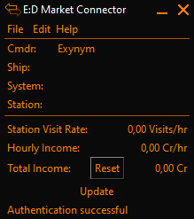

# Hourly Income EDMC Plugin

## Athanasius' Version

Mostly just to fix "`config.get()` is deprecated" logging at startup I forked
this to also make any further improvements.  On 2022-08-13 when I performed the
fork, Exynom hadn't updated the plugin in "3 years" according to GitHun, and
had very little in the way of GitHub activity otherwise.

## Exynom's README
This is a simple plugin for [EDMarketConnector](https://github.com/EDCD/EDMarketConnector/wiki),
based on and adapted from the [EDMCJumpSpeed](https://github.com/inorton/EDMCJumpSpeed)
plugin, so credit for most of the work done should be directed to their makers!



As with other EDMC plugins, simply unzip the git directory into your plugins folder (or just place load.py inside a directory within the plugins directory) yielding something like
```
EDMarketConnector\plugins\EDMC-HourlyIncome-master\load.py
```
and restart EDMC afterwards.
